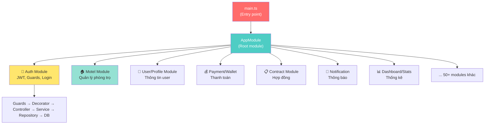

# 🗺️ Lộ Trình Học NestJS — Từ Intern Đến Bảo Trì Dự Án Rencity

## 📊 Đánh Giá Hiện Tại Của Bạn

### ✅ Những gì bạn ĐÃ BIẾT (từ posts-crud-nestjs)

| Khái niệm | File minh chứng | Mức độ |
|---|---|---|
| Module / Controller / Service (bộ 3 cơ bản) | [posts.module.ts](file:///home/backend/posts-crud-nestjs/src/posts/posts.module.ts), [posts.controller.ts](file:///home/backend/posts-crud-nestjs/src/posts/posts.controller.ts), [posts.service.ts](file:///home/backend/posts-crud-nestjs/src/posts/posts.service.ts) | ⭐⭐ Nhận diện được |
| CRUD cơ bản với TypeORM | [posts.service.ts](file:///home/backend/posts-crud-nestjs/src/posts/posts.service.ts) | ⭐⭐ Làm theo được |
| DTO & Validation | [dto/](file:///home/backend/posts-crud-nestjs/src/posts/dto) | ⭐⭐ Làm theo được |
| Query Builder cơ bản | [posts.service.ts#L25-L46](file:///home/backend/posts-crud-nestjs/src/posts/posts.service.ts#L25-L46) | ⭐⭐ Làm theo được |
| ConfigModule + TypeORM async config | [app.module.ts](file:///home/backend/posts-crud-nestjs/src/app.module.ts) | ⭐ Biết dùng |
| Middleware cơ bản | [app.module.ts#L41-L44](file:///home/backend/posts-crud-nestjs/src/app.module.ts#L41-L44) | ⭐ Biết dùng |

### ❌ Những gì bạn CHƯA BIẾT (nhưng Rencity đang dùng)

| Khái niệm | Dùng ở đâu trong Rencity | Độ khó |
|---|---|---|
| **Guards (Auth/JWT)** | `src/auth/guards/` | 🟡 Trung bình |
| **Custom Decorators** | `src/common/decorators/` | 🟡 Trung bình |
| **Interceptors** | `src/common/interceptors/` | 🟡 Trung bình |
| **Exception Filters** | `src/common/filters/` | 🟡 Trung bình |
| **Repository Pattern** | Mỗi module có `repositories/` riêng | 🟡 Trung bình |
| **Redis + Cache** | `src/redis-config/`, CacheModule | 🔴 Khó |
| **WebSocket** | `src/websocket/` | 🔴 Khó |
| **Event Emitter** | EventEmitterModule | 🟡 Trung bình |
| **Schedule (Cron jobs)** | ScheduleModule, `src/user/crons/` | 🟡 Trung bình |
| **Swagger/API docs** | [main.ts](file:///home/backend/rencity_be_nestjs/src/main.ts#L60-L72) | 🟢 Dễ |
| **Firebase** | [app.module.ts#L240-L254](file:///home/backend/rencity_be_nestjs/src/app.module.ts#L240-L254) | 🔴 Khó |
| **AWS S3** | `@aws-sdk/client-s3` | 🔴 Khó |
| **Database Migrations** | `migrations/`, `data-source.ts` | 🟡 Trung bình |
| **Docker** | `Dockerfile`, `docker-compose.yml` | 🟡 Trung bình |
| **Permission System (CASL)** | `@casl/ability`, `src/system_permissions/` | 🔴 Khó |
| **Payment Integration** | `src/payment/`, `@payos/node` | 🔴 Khó |

---

## 🎯 Lộ Trình Học — 4 Giai Đoạn

---

### 📌 GIAI ĐOẠN 1: Củng cố nền tảng (Tuần 2-3)

> [!IMPORTANT]
> **Mục tiêu:** Code tay được CRUD hoàn chỉnh KHÔNG cần hỏi AI. Đây là nền móng, không vững thì lên cao sẽ sụp.

#### 1.1. Luyện tập "cơ bắp" — Code tay lặp lại

**Bài tập:** Tự tay code lại TOÀN BỘ posts-crud-nestjs từ đầu, KHÔNG nhìn code cũ, KHÔNG hỏi AI.

```
Lần 1: Mở code cũ để nhìn → code lại
Lần 2: Đóng code cũ, chỉ nhìn danh sách file → code lại
Lần 3: Đóng hết, tự code từ trắng → nếu bí thì google/docs
Lần 4: Tự code + thêm 1 module mới (ví dụ: Categories)
```

#### 1.2. Hiểu SÂU thay vì chỉ "nhặt code"

Với mỗi khái niệm, trả lời được 3 câu hỏi:
1. **NÓ LÀ GÌ?** (định nghĩa bằng lời của mình)
2. **TẠI SAO DÙNG NÓ?** (không dùng thì sao?)
3. **KHI NÀO DÙNG?** (tình huống thực tế)

**Checklist kiến thức cần nắm vững:**

- [ ] **Dependency Injection** — Tại sao NestJS dùng `constructor(private service: XService)` mà không `new XService()`?
- [ ] **Decorator pattern** — `@Controller()`, `@Injectable()`, `@Get()` hoạt động như nào?
- [ ] **Module system** — `imports`, `providers`, `controllers`, `exports` khác nhau ra sao?
- [ ] **DTO + Validation Pipe** — Tại sao cần DTO? `class-validator` làm gì?
- [ ] **TypeORM Entity** — Mapping entity với bảng DB ra sao?
- [ ] **Repository pattern** — `Repository<Entity>` và `@InjectRepository()` hoạt động thế nào?
- [ ] **Exception handling** — `NotFoundException`, `BadRequestException` dùng khi nào?
- [ ] **Async/Await** — Promise trong NestJS hoạt động ra sao?

#### 1.3. Tài liệu đọc

- 📖 [NestJS Official Docs — First Steps → Overview](https://docs.nestjs.com/first-steps) (đọc lần lượt từ First Steps đến Guards)
- 📖 [TypeORM Documentation](https://typeorm.io/) (phần Entity, Repository, QueryBuilder)

> [!TIP]
> **Cách đọc docs hiệu quả:** Đọc 1 page → Code thử ngay → Sai thì đọc lại. KHÔNG đọc liền 10 trang rồi quên hết.

---

### 📌 GIAI ĐOẠN 2: Đọc hiểu source Rencity (Tuần 3-4)

> [!IMPORTANT]
> **Mục tiêu:** Hiểu được kiến trúc tổng thể, flow request đi qua những layer nào, và cách các module liên kết.

#### 2.1. Bản đồ tổng quan dự án

Rencity là một ứng dụng **quản lý phòng trọ / nhà cho thuê** với 61 module. Đừng hoảng! Bạn KHÔNG cần hiểu hết ngay.



#### 2.2. Thứ tự đọc source (QUAN TRỌNG!)

> [!CAUTION]
> **SAI:** Mở random từng file đọc → Chóng mặt → Bỏ cuộc.
> **ĐÚNG:** Đọc theo flow, từ tổng thể đến chi tiết, từ đơn giản đến phức tạp.

**Bước 1 — Hiểu Entry Point:**

| Thứ tự | File | Học gì |
|--------|------|--------|
| 1 | [main.ts](file:///home/backend/rencity_be_nestjs/src/main.ts) | App khởi tạo thế nào, CORS, prefix `/api`, Swagger, body parser |
| 2 | [app.module.ts](file:///home/backend/rencity_be_nestjs/src/app.module.ts) | Toàn bộ module được import ở đây, config Redis, TypeORM, Firebase |

**Bước 2 — Hiểu Common (phần dùng chung):**

| Thứ tự | Thư mục | Học gì |
|--------|---------|--------|
| 3 | `src/common/decorators/` | Custom decorators (như `@CurrentUser()`) |
| 4 | `src/common/guards/` hoặc `src/auth/guards/` | Authentication guard — filter request nào cần login |
| 5 | `src/common/filters/` | Exception filter — xử lý lỗi chung |
| 6 | `src/common/interceptors/` | Chặn response để transform data |
| 7 | `src/common/dtos/` | DTO dùng chung (pagination, base response...) |
| 8 | `src/common/entities/` | Base entity (có sẵn createdAt, updatedAt...) |

**Bước 3 — Đọc 1 module đơn giản đầu-đuôi (ví dụ: `banner` hoặc `popup`):**

Với mỗi module, đọc theo thứ tự:
```
1. module.ts      → Import những gì?
2. entities/      → Database schema trông thế nào?
3. dtos/          → Client gửi data gì lên?
4. repositories/  → Truy vấn DB ra sao? (Pattern mới so với project cũ)
5. services/      → Business logic
6. controllers/   → API endpoints
```

**Bước 4 — Đọc Auth module (flow quan trọng nhất):**

Hiểu flow: `User gửi request → Guard check JWT → Decorator lấy user → Controller → Service`

#### 2.3. So sánh pattern Rencity vs Posts-CRUD

| Aspect | Posts-CRUD (của bạn) | Rencity (công ty) |
|--------|---------------------|-------------------|
| Inject DB | `@InjectRepository()` trực tiếp trong Service | Tách riêng `repositories/` folder |
| Auth | Không có | JWT Guard + Custom Decorator |
| Error handling | `throw new NotFoundException()` | Custom `AllExceptionsFilter` |
| Cấu trúc module | Flat (controller, service, module cùng cấp) | Nested (controllers/, services/, dtos/, entities/, repositories/) |
| Config | `ConfigModule` đơn giản | `ConfigModule` + `globalConfig` + `.env` phức tạp |
| Cache | Không có | Redis Cache |
| API docs | Không có | Swagger tự động |

---

### 📌 GIAI ĐOẠN 3: Thực hành trên Rencity (Tuần 4-6)

> [!IMPORTANT]
> **Mục tiêu:** Có thể fix bug nhỏ và thêm field/API đơn giản vào dự án.

#### 3.1. Setup & chạy được project

```bash
# 1. Cài dependencies
cd /home/backend/rencity_be_nestjs
yarn install

# 2. Setup .env (hỏi team lead lấy file .env cho môi trường dev)

# 3. Cần có: MySQL, Redis chạy sẵn
docker run -d --name redis-stack -p 6379:6379 -p 8001:8001 redis/redis-stack:latest

# 4. Chạy dev
yarn dev

# 5. Mở Swagger xem API docs
# http://localhost:3000/api/swagger
```

#### 3.2. Bài tập thực hành từ dễ đến khó

| Level | Bài tập | Kỹ năng rèn |
|-------|---------|-------------|
| 🟢 1 | Đọc Swagger, test thử 5 API bằng Postman/Insomnia | Hiểu API structure |
| 🟢 2 | Thêm 1 field mới vào 1 entity đơn giản (ví dụ: thêm `note` vào Banner) | Entity + DTO + Migration |
| 🟡 3 | Viết 1 API GET mới (ví dụ: lọc motel theo giá) | Controller + Service + QueryBuilder |
| 🟡 4 | Fix 1 bug nhỏ (hỏi team lead cho bug dễ) | Debug + đọc hiểu code người khác |
| 🟡 5 | Tạo 1 module mới hoàn chỉnh theo pattern Rencity | Toàn bộ flow |
| 🔴 6 | Viết API có auth (cần login mới dùng được) | Guard + Decorator |

#### 3.3. Kỹ năng debug quan trọng

```typescript
// 1. Console.log có chiến lược (đừng log bừa)
console.log('=== [ServiceName.methodName] ===');
console.log('Input:', JSON.stringify(input, null, 2));
console.log('Result:', result);

// 2. Đọc error message THẬT KỸ
// NestJS error thường rất rõ ràng, đọc từ dòng đầu tiên

// 3. Dùng Swagger để test API trước khi đổ lỗi cho code
```

---

### 📌 GIAI ĐOẠN 4: Join dự án thực sự (Tuần 6+)

> [!IMPORTANT]
> **Mục tiêu:** Nhận task từ team lead, hoàn thành và tạo merge request.

#### 4.1. Workflow làm việc

```
1. Nhận task trên Jira/GitLab Issue
2. Tạo branch mới: git checkout -b feature/ten-task
3. Đọc hiểu module liên quan
4. Code → Test bằng Swagger/Postman
5. Commit → Push → Tạo Merge Request
6. Team lead review → Fix feedback → Merge
```

#### 4.2. Cách hỏi đúng khi bí

> [!TIP]
> **Trước khi hỏi AI hoặc đồng nghiệp, hãy tự tìm trước:**
> 1. Search trong source code (Ctrl+Shift+F) xem có ai làm tương tự chưa
> 2. Đọc NestJS docs phần liên quan
> 3. Đọc error message thật kỹ
> 4. Nếu vẫn bí → hỏi kèm context: "Em đang làm X, đã thử Y, nhưng bị lỗi Z"

---

## 📅 Bảng Tóm Tắt Lộ Trình

| Tuần | Giai đoạn | Việc cần làm | Tiêu chí hoàn thành |
|------|-----------|-------------|---------------------|
| 2-3 | Củng cố nền tảng | Code lại CRUD 3 lần, đọc docs | Tự code CRUD không cần AI |
| 3-4 | Đọc source Rencity | Đọc theo thứ tự ở trên, ghi chú | Vẽ được flow request trong Rencity |
| 4-6 | Thực hành | Chạy project, làm bài tập, fix bug | Thêm được API mới theo pattern |
| 6+ | Join dự án | Nhận task thực, tạo MR | Hoàn thành task nhỏ tự tin |

---

## 🧠 Mindset Quan Trọng

> [!WARNING]
> ### Những sai lầm hay gặp của intern:
> 1. **"Copy paste xong chạy được là xong"** → SAI. Phải hiểu TẠI SAO nó chạy.
> 2. **"Đọc hết docs rồi mới code"** → SAI. Đọc 1 tí → code thử → đọc tiếp.
> 3. **"Cái này khó quá, hỏi AI cho nhanh"** → Hỏi AI để HIỂU, không phải để copy.
> 4. **"61 module, biết đọc bao giờ cho hết"** → KHÔNG cần đọc hết. Chỉ cần hiểu pattern, rồi module nào cũng giống nhau.
> 5. **"Sợ sai nên không dám code"** → Bạn đang ở local, sai bao nhiêu cũng được. Git sẽ cứu bạn.

> [!TIP]
> ### Quy tắc vàng:
> **"Hiểu 1 module sâu > Lướt qua 10 module"**
> 
> Khi bạn thật sự hiểu cách `motel` module hoạt động từ A-Z (entity → dto → repository → service → controller → guard), thì 60 module còn lại chỉ là lặp lại pattern đó.

---

## ❓ Câu Hỏi Cho Bạn

Để mình hướng dẫn tiếp hiệu quả hơn, bạn cho mình biết:

1. **Bạn muốn bắt đầu từ giai đoạn nào?** (Nếu tự tin CRUD thì nhảy thẳng GĐ2)
2. **Bạn có setup được MySQL + Redis chưa?** (Cần để chạy Rencity)
3. **Team lead đã giao task cụ thể nào chưa?** (Nếu có thì mình hướng dẫn theo task luôn)
